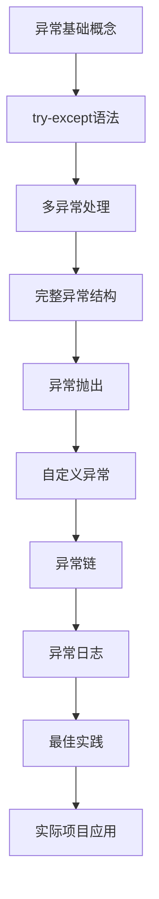

# 18-异常处理 (Exception Handling)

## 学习目标

通过本模块的学习，你将掌握：

- 理解Python异常处理的基本概念和机制
- 掌握try-except-else-finally语句的使用
- 学会处理多种异常类型和异常链
- 能够创建和使用自定义异常
- 掌握异常日志记录和调试技巧
- 了解异常处理的最佳实践和设计模式

## 主要内容概述

异常处理是Python编程中的重要概念，它允许程序优雅地处理运行时错误，而不是让程序崩溃。本模块将从基础概念开始，逐步深入到高级应用和最佳实践。

### 核心知识点

1. **异常基础** - 理解什么是异常，常见异常类型
2. **异常捕获** - 使用try-except语句捕获和处理异常
3. **多异常处理** - 处理多种不同类型的异常
4. **完整异常处理** - else和finally子句的使用
5. **异常抛出** - 主动抛出异常和异常传播
6. **自定义异常** - 创建符合业务需求的异常类
7. **异常链** - 异常的上下文和链式传播
8. **异常日志** - 记录和调试异常信息
9. **最佳实践** - 异常处理的设计模式和优化技巧

## 学习路径



## 章节导航

### 基础篇
- [01. 异常基础概念](./01_exception_basics.md) - 理解异常的本质和Python异常体系
- [02. try-except语法](./02_try_except.md) - 掌握基本的异常捕获语法
- [03. 多异常处理](./03_multiple_except.md) - 学会处理多种不同类型的异常
- [04. else和finally子句](./04_else_finally.md) - 完整的异常处理结构

### 进阶篇
- [05. 抛出异常](./05_raise_exception.md) - 主动抛出异常和异常传播
- [06. 自定义异常](./06_custom_exceptions.md) - 创建符合业务需求的异常类
- [07. 异常链和上下文](./07_exception_chaining.md) - 异常的链式传播和上下文管理

### 实践篇
- [08. 异常日志记录](./08_logging_exceptions.md) - 记录和调试异常信息
- [09. 最佳实践](./09_best_practices.md) - 异常处理的设计模式和优化技巧

## 学习建议

### 学习顺序
1. **基础阶段** (01-04): 掌握异常处理的基本语法和概念
2. **进阶阶段** (05-07): 学习异常的高级特性和应用
3. **实践阶段** (08-09): 掌握实际项目中的异常处理技巧

### 实践要点
1. **动手实践**: 每个章节都包含可运行的代码，建议逐一执行并观察结果
2. **修改实验**: 尝试修改代码参数，观察不同情况下的异常行为
3. **场景应用**: 思考如何将学到的异常处理技巧应用到实际项目中
4. **代码调试**: 学会使用异常信息进行程序调试

## 代码示例

### 基本异常处理

```python
try:
    result = 10 / 0
except ZeroDivisionError as e:
    print(f"除零错误: {e}")
else:
    print(f"计算结果: {result}")
finally:
    print("清理资源")
```

### 自定义异常

```python
class ValidationError(Exception):
    """数据验证异常"""
    def __init__(self, message, field=None):
        super().__init__(message)
        self.field = field

def validate_age(age):
    if age < 0:
        raise ValidationError("年龄不能为负数", field="age")
    if age > 150:
        raise ValidationError("年龄不能超过150岁", field="age")
```

### 异常链

```python
try:
    # 底层操作
    database_operation()
except DatabaseError as e:
    # 转换为业务异常
    raise BusinessError("用户数据处理失败") from e
```

## 注意事项

::: warning 重要提醒
1. **不要滥用异常**: 异常应该用于处理异常情况，而不是正常的程序流程控制
2. **具体异常处理**: 尽量捕获具体的异常类型，避免使用过于宽泛的Exception
3. **资源清理**: 确保在异常发生时能够正确清理资源
4. **异常信息**: 提供有用的异常信息，帮助调试和问题定位
5. **性能考虑**: 异常处理有性能开销，在性能敏感的代码中要谨慎使用
:::

## 实际应用场景

### Web开发中的异常处理
- API错误响应处理
- 用户输入验证
- 数据库连接异常
- 第三方服务调用失败

### 数据处理中的异常处理
- 文件读写异常
- 数据格式错误
- 网络请求超时
- 内存不足处理

### 系统编程中的异常处理
- 系统资源访问
- 进程间通信
- 硬件设备操作
- 权限验证失败

## 扩展学习

- **并发异常处理**: 多线程和异步编程中的异常处理
- **分布式异常处理**: 微服务架构中的异常传播和处理
- **异常监控**: 生产环境中的异常监控和报警
- **异常恢复**: 自动异常恢复和容错机制

## 相关资源

- [Python官方文档 - 异常处理](https://docs.python.org/3/tutorial/errors.html)
- [PEP 3134 - 异常链和嵌入回溯](https://www.python.org/dev/peps/pep-3134/)
- [Python异常处理最佳实践](https://realpython.com/python-exceptions-handling/)

---

通过系统学习本模块，你将能够编写更加健壮和可靠的Python程序，有效处理各种异常情况，提升代码质量和用户体验。